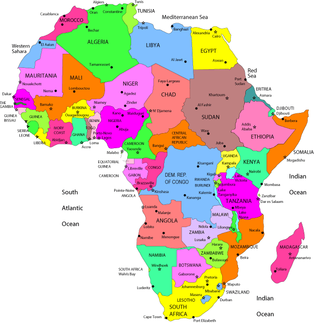
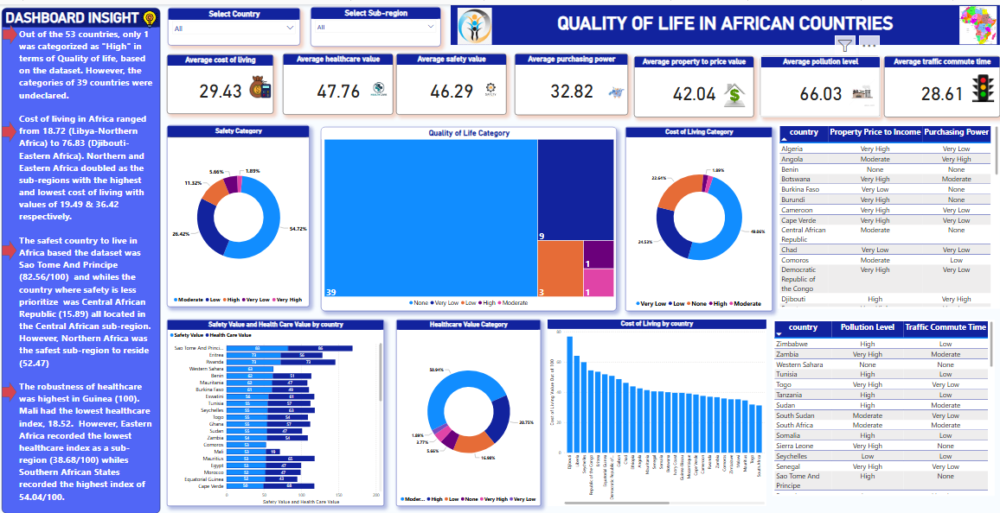

# Quality-of-Life-in-African-Countries
---


## Table of Content

- [Project Objectives](#Objectives)
- [Data Source](#Data-Source)
- [Tools used](#Tools-Used)
- [Data cleaning & transformation](#Data-Cleaning-transformation)
- [Exploratory Analysis](#Exploratory-Analysis)
- [Dax measures Used](#Dax-Measures-Used)
- [Dashboard Output](#Final-Dashboard-Output)
- [Summary of Insight](#roject Insight)


## Objectives
1. Clean the data
2. Create a new column for sub-regions corresponding to each of the countries
3. Extract only the countries from the African Continent
4. Connect data to Power BI
5. Create measures using Dax in Powwer BI
6. Build Dashborad
7. Document insights
 
## Data Source
The data was downloaded from Kaggle. Click here to assess the data https://www.kaggle.com/datasets/ahmedmohamed2003/quality-of-life-for-each-country

## Tools Used
1. MySQL database for data cleaning, transformation & analysis
2. Power BI for creating interactive Dashboard
3. Github repository and pages for hosting project documents
4. Microsoft Word for insight documentation 

## Data Cleaning and Transformation
Data was cleaned using MysQL. Codes, below

### SQL Query 1
```sql
-- checking the information about the entire table
SELECT count(*)
FROM INFORMATION_SCHEMA.COLUMNS
where TABLE_NAME= "quality_of_life";
```

### SQL Query 2
```sql
-- Creating New column for sub_regions
ALTER TABLE quality_of_life
ADD  sub_region VARCHAR(20);

-- updating continent column for West African states (n=16)
UPDATE quality_of_life
SET sub_region = "Western Africa"
WHERE country IN ('Benin', 'Burkina Faso', 'Cape Verde', 'Ivory Coast', 'The Gambia', 'Ghana', 'Guinea', 'Guinea-Bissau', 'Liberia', 'Mali',
				'Niger', 'Nigeria', 'Senegal', 'Sierra Leone','Togo');
             
             
 -- updating continent column for North African states (n=7)
UPDATE quality_of_life
SET sub_region = "Northern Africa"
WHERE country IN ('Algeria', 'Egypt', 'Libya', 'Morocco', 'Sudan', 'Tunisia', 'Western Sahara');     
           

 -- updating continent column for East African states (n=13)
UPDATE quality_of_life
SET sub_region = "Eastern Africa"
WHERE country IN ('Burundi', 'Comoros', 'Djibouti', 'Ethiopia', 'Eritrea', 'Kenya', 'Rwanda', 'Seychelles', 'Somalia',
				'South Sudan', 'Sudan', 'Tanzania','Uganda');
                

 -- updating continent column for Central African states (n=11) 
UPDATE quality_of_life
SET sub_region = "Central Africa"
WHERE country IN ('Angola', 'Burundi', 'Chad', 'Equatorial Guinea', 'Gabon', 'Cameroon', 'Central African Republic', 'Democratic Republic of the Congo',
'Republic of the Congo','Rwanda', 'Sao Tomé and Principe');


-- updating continent column for South African states (n=13) 
UPDATE quality_of_life
SET sub_region = "Southern Africa"
WHERE country IN ('Botswana','Eswatini', 'Gambia','Lesotho', 'Madagascar', 'Malawi','Mauritania', 'Mauritius', 'Mozambique', 'Namibia', 
				'South Africa', 'Zambia', 'Zimbabwe');
```

### SQL Query 3
```sql
-- extracting Only African countries from the data
CREATE VIEW qol_Africa AS
	SELECT *
	FROM 
		quality_of_life
	WHERE
		sub_region IS NOT NULL;
        
-- Checking final selected dataset
SELECT *
FROM 
	quality_of_life.qol_africa;
 ```
## Exploratory Analysis
Some queries were run to find anwers to series of questions that provides better understanding of the data. These queries were executed to explore details regarding of the seven(7) indicators used for measuring the quality of life.

### SQL Query 4 (Analysis on cost of living)
```sql
-- ANALYSIS ON COST OF LIVING
		-- average cost of living for entire Africa
		SELECT AVG(`Cost of Living Value`) AS 'average_cost_of_living(Africa) '
		FROM quality_of_life.qol_africa;

		-- average cost of living for western Africa
		SELECT AVG(`Cost of Living Value`) AS 'average_cost_of_living(Western Africa) '
		FROM quality_of_life.qol_africa
		WHERE sub_region = "Western Africa";

		-- average cost of living for Eastern Africa
		SELECT AVG(`Cost of Living Value`) AS 'average_cost_of_living(Eastern Africa) '
		FROM quality_of_life.qol_africa
		WHERE sub_region = "Eastern Africa";

		-- average cost of living for Northern Africa
		SELECT AVG(`Cost of Living Value`) AS 'average_cost_of_living(Northern Africa) '
		FROM quality_of_life.qol_africa
		WHERE sub_region = "Northern Africa";

		-- average cost of living for Southern Africa
		SELECT AVG(`Cost of Living Value`) AS 'average_cost_of_living(Southern Africa) '
		FROM quality_of_life.qol_africa
		WHERE sub_region = "Southern Africa";

		-- average cost of living for Central Africa
		SELECT AVG(`Cost of Living Value`) AS 'average_cost_of_living(Central Africa) '
		FROM quality_of_life.qol_africa
		WHERE sub_region = "Central Africa";

		-- Finding country with the lowest cost of living and its corresponding sub-region
		SELECT country, (`Cost of Living Value`), sub_region
		FROM quality_of_life.qol_africa
		WHERE `Cost of Living Value` > 0
		ORDER BY `Cost of Living Value` ASC;

		-- Finding country with the highest cost of living and its corresponding sub-region
		SELECT country, (`Cost of Living Value`), sub_region
		FROM quality_of_life.qol_africa
		WHERE `Cost of Living Value` > 0
		ORDER BY `Cost of Living Value` DESC;
```
## SQL Query 5 (Anaysis on Safety Index)
```sql
-- ANALYSIS ON SAFETY INDEX 
		-- average safety index for entire Africa
		SELECT AVG(`Safety Value`) AS 'average_Safety_Value(Africa)'
		FROM quality_of_life.qol_africa;

		-- average Safety Value for western Africa
		SELECT AVG(`Safety Value`) AS 'average_Safety Value(Western Africa) '
		FROM quality_of_life.qol_africa
		WHERE sub_region = "Western Africa";

		-- average Safety Value for Eastern Africa
		SELECT AVG(`Safety Value`) AS 'average_Safety Value(Eastern Africa) '
		FROM quality_of_life.qol_africa
		WHERE sub_region = "Eastern Africa";

		-- average Safety Value for Northern Africa
		SELECT AVG(`Safety Value`) AS 'average_Safety Value(Northern Africa) '
		FROM quality_of_life.qol_africa
		WHERE sub_region = "Northern Africa";

		-- average Safety Value for Southern Africa
		SELECT AVG(`Safety Value`) AS 'average_Safety Value(Southern Africa) '
		FROM quality_of_life.qol_africa
		WHERE sub_region = "Southern Africa";

		-- average Safety Value for Central Africa
		SELECT AVG(`Safety Value`) AS 'average_Safety Value(Central Africa) '
		FROM quality_of_life.qol_africa
		WHERE sub_region = "Central Africa";

		-- Finding country with the lowest Safety Value and its corresponding sub-region
		SELECT country, (`Safety Value`), sub_region
		FROM quality_of_life.qol_africa
		WHERE `Safety Value` > 0
		ORDER BY `Safety Value`ASC;

		-- Finding country with the highest Safety Value and its corresponding sub-region
		SELECT country, (`Safety Value`), sub_region
		FROM quality_of_life.qol_africa
		WHERE `Safety Value` > 0
		ORDER BY `Safety Value` DESC;
```

## SQL Query 6 (Analysis on healthcare index)

```sql
-- ANALYSIS ON HEALTHCARE INDEX
		-- average healthcare index for entire Africa
		SELECT AVG(`Health Care Value`) AS 'Average Health Care Value(Africa)'
		FROM quality_of_life.qol_africa;

		-- average Health Care Value for western Africa
		SELECT AVG(`Health Care Value`) AS 'average Health Care Value(Western Africa) '
		FROM quality_of_life.qol_africa
		WHERE sub_region = "Western Africa";

		-- average Health Care Value for Eastern Africa
		SELECT AVG(`Health Care Value`) AS 'average_Health Care Value(Eastern Africa) '
		FROM quality_of_life.qol_africa
		WHERE sub_region = "Eastern Africa";

		-- average Health Care Value for Northern Africa
		SELECT AVG(`Health Care Value`) AS 'average_Health Care Value(Northern Africa) '
		FROM quality_of_life.qol_africa
		WHERE sub_region = "Northern Africa";

		-- average Health Care Value for Southern Africa
		SELECT AVG(`Health Care Value`) AS 'average_Health Care Value(Southern Africa) '
		FROM quality_of_life.qol_africa
		WHERE sub_region = "Southern Africa";

		-- average Health Care Value for Central Africa
		SELECT AVG(`Health Care Value`) AS 'average_Health Care Value(Central Africa) '
		FROM quality_of_life.qol_africa
		WHERE sub_region = "Central Africa";

		-- Finding country with the lowest Health Care Value and its corresponding sub-region
		SELECT country, (`Health Care Value`), sub_region
		FROM quality_of_life.qol_africa
		WHERE `Health Care Value` > 0
		ORDER BY `Health Care Value`ASC;

		-- Finding country with the highest Health Care Value and its corresponding sub-region
		SELECT country, (`Health Care Value`), sub_region
		FROM quality_of_life.qol_africa
		WHERE `Health Care Value` > 0
		ORDER BY `Health Care Value` DESC;
```

## Dax Measures Used
The following Dax Measures were calculated used as KPI on the dashboard.
```Dax
Avg CoL = AVERAGE(Quality_of_life_africa[Cost of Living Value])
Avg Healthcare Value = AVERAGE(Quality_of_life_africa[Health Care Value])
Avg pollution level = AVERAGE(Quality_of_life_africa[Pollution Value])
Avg property price to income = AVERAGE(Quality_of_life_africa[Property Price to Income Value])
Avg purchasing p = AVERAGE(Quality_of_life_africa[Purchasing Power Value])
Avg Safety Value = AVERAGE(Quality_of_life_africa[Safety Value])
Avg traffic commute time = AVERAGE(Quality_of_life_africa[Traffic Commute Time Value])
```
## Final-Dashboard-Output
Data was visualized via Interactive Power BI dashboard. 

